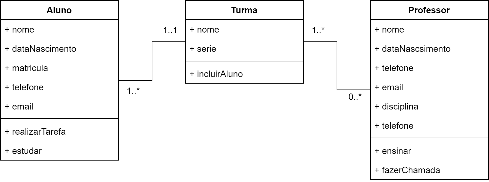

# Tarefa - Classe e Objeto
## Tarefa 1 - Aula 3

Utilizando os conceitos abordados na aula de hoje, faça uma modelagem orientada a objetos de uma escola com as seguintes entidades:

 - Aluno
 - Turma
 - Professor

Lembre-se de pensar nas características e ações de cada classe, bem como nos possíveis relacionamentos e respectivas cardinalidades. Sua entrega deverá ser feita através de um Diagrama de Classes, conforma apresentado na aula de hoje. Você poderá fazê-lo tanto à mão, quanto através de uma ferramenta gráfica como o https://app.diagrams.net/. Caso seu diagrama seja feito à mão procure se certificar de que o documento enviado está legível. Uma sugestão é utilizar aplicativos de scanner com a câmera do smartphone ou tablet.

A Etapa 1 contará com 5 atividades pontuadas, cada qual valendo um total de 2 pontos. Esta atividade é a primeira das 5, valendo portanto 2 pontos na nota da Etapa 1. As atividades foram pensadas para serem propostas sempre na Semana 2, com prazo de envio para duas semanas. Desta forma sempre teremos uma aula síncrona na Semana 1 para solucionar dúvidas dos exercícios propostos.

Bons estudos!

Solução

